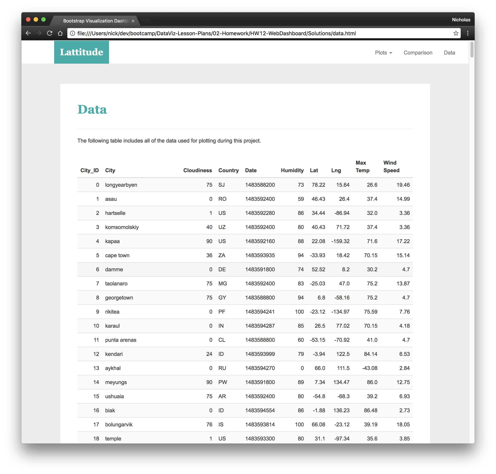

# Web Visualization Dashboard

Task
* A landing page containing:
  * An explanation of the project.
  * Links to each visualizations page.
* Four visualization pages, each with:
  * A descriptive title and heading tag.
  * The plot/visualization itself for the selected comparison.
  * A paragraph describing the plot and its significance.
* A "Comparative Analysis" page that:
  * Contains all of the visualizations on the same page so we can easily visually compare them.
  * Uses a bootstrap grid for the visualizations.
* A "Data" page that:
  * Displays a responsive table containing the data used in the visualizations.

Output

